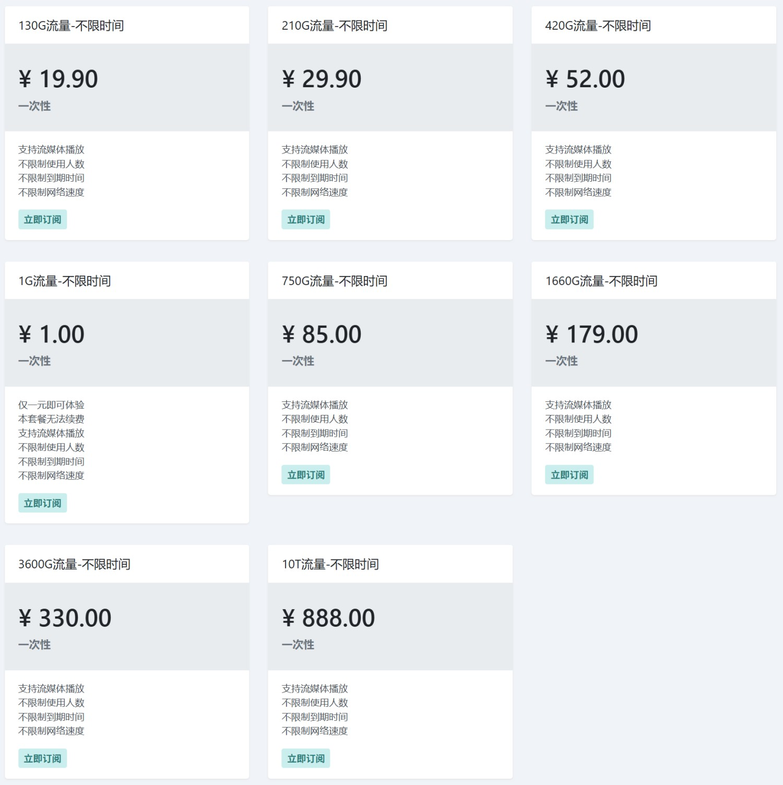

# 2026 魔戒机场（Mojie.app）最新官网地址

- 最新官网地址：[https://mojie.app/](https://mojie.app/#/register?code=LhoX7Ptm)
- 备用地址 1 ：[https://mojie.co/](https://mojie.co/#/register?code=LhoX7Ptm) 
- 备用地址 2 ：[https://mojie.host/](https://mojie.host/#/register?code=LhoX7Ptm) 

## 一、魔戒机场优惠活动

魔戒机场是一家专注于流量套餐服务的机场平台，最大的特色就是**流量永久有效、永不过期**。

与传统按月订阅模式不同，魔戒机场采用一次性购买流量包的方式，用户无需担心套餐到期清零，也无需每月续费，非常适合轻度用户、备用线路用户以及长期稳定使用群体。

## 二、魔戒机场主要特色

魔戒机场致力于为用户提供稳定、高速、灵活的网络加速服务，提供 Vmess、Trojan、AnyTLS、HY2 等通用主流协议的节点，主要特色如下：

### 永不过期流量

- 所有套餐均采用一次性购买模式。
- 流量购买后长期有效，无时间限制。
- 不存在月度重置或到期清零问题。
- 按需购买，用完再充值。

### 流媒体解锁支持

- 支持 Netflix、Disney+、YouTube Premium 等主流流媒体平台。
- 提供优质国际线路，观看高清视频更加流畅。
- 满足海外影视、音乐及娱乐内容访问需求。

### 不限制设备数量

- 不限制同时使用设备数量。
- 手机、电脑、平板等设备均可使用。
- 适合家庭共享或多设备用户。

### 不限制网络速度

- 所有套餐均不限速。
- 可充分发挥本地网络带宽性能。
- 适用于高清视频播放、文件下载、远程办公等场景。

### 高性价比

- 最低仅需 1 元即可体验服务。
- 大流量套餐价格实惠。
- 流量单价随着套餐升级进一步降低。

### 多平台支持

- 支持 Windows、macOS、Android、iOS 等主流系统。
- 支持 Clash、Shadowrocket、Surge、Stash 等常见客户端。
- 配置简单，上手方便。

---

## 三、魔戒机场套餐价格

魔戒机场采用一次性购买流量模式，购买后流量永久有效。

| 套餐名称 | 价格 | 流量 | 有效期 |
|-----------|---------|---------|---------|
| 体验套餐 | ¥1.00 | 1G | 永不过期 |
| 入门套餐 | ¥19.90 | 130G | 永不过期 |
| 标准套餐 | ¥29.90 | 210G | 永不过期 |
| 热门套餐 | ¥52.00 | 420G | 永不过期 |
| 高级套餐 | ¥85.00 | 750G | 永不过期 |
| 专业套餐 | ¥179.00 | 1660G | 永不过期 |
| 企业套餐 | ¥330.00 | 3600G | 永不过期 |
| 至尊套餐 | ¥888.00 | 10TB | 永不过期 |

### 套餐详情

#### 1G 体验套餐

- 售价：¥1.00
- 流量：1G
- 体验套餐

适合首次体验用户测试线路质量和速度。

---
以下所有套餐均：  

- 支持流媒体解锁
- 不限制使用人数
- 不限制网络速度
- 流量 **永不过期**

#### 130G 入门套餐

- 售价：¥19.90
- 流量：130G

适合日常浏览网页、社交媒体及轻度视频用户。

---

#### 210G 标准套餐

- 售价：¥29.90
- 流量：210G

适合经常观看视频及中等流量需求用户。

---

#### 420G 热门套餐

- 售价：¥52.00
- 流量：420G

综合性价比较高，是多数用户的热门选择。

---

#### 750G 高级套餐

- 售价：¥85.00
- 流量：750G

适合重度流媒体用户及多设备家庭用户。

---

#### 1660G 专业套餐

- 售价：¥179.00
- 流量：1660G
- 永不过期

适合长期稳定使用以及团队共享需求。

---

#### 3600G 企业套餐

- 售价：¥330.00
- 流量：3600G
- 永不过期

适合高流量需求用户及小型团队。

---

#### 10TB 至尊套餐

- 售价：¥888.00
- 流量：10TB
超大流量配置，适合企业级用户及长期重度使用场景。

### 节点信息

| 节点名称 | 状态 | 标签 |
| :--- | :--- | :--- |
| 日本-优化 | Online | 流媒体, 联通中转 |
| 日本-优化2 | Online | 流媒体, 移动中转 |
| 日本-优化3 | Online | 电信中转, 流媒体 |
| 日本JP-HY2 | Offline | - |
| 日本JP-A | Online | - |
| 新加坡SG-HY2 | Online | - |
| 新加坡SG-A | Online | - |
| 新加坡-优化 | Online | 流媒体, 联通优化 |
| 新加坡-优化2 | Online | 流媒体, 移动中转 |
| 新加坡-优化3 | Online | 电信中转, 流媒体 |
| 香港HK-A | Online | - |
| 香港HKT-HY2 | Online | - |
| 香港-优化 | Online | 原生IP, 移动中转, 流媒体 |
| 香港-优化2 | Online | 原生IP, 移动中转, 流媒体 |
| 香港-优化3 | Online | 流媒体 |
| 香港WAP-优化 | Online | 流媒体, 联通中转, 原生IP |
| 香港WAP-优化2 | Online | 流媒体, 移动中转 |
| 香港WAP-优化3 | Online | 流媒体 |
| 德国DE-HY2 | Online | - |
| 印度-优化 | Online | 中转, 联通优化, 广播IP |
| 台湾-优化 | Online | 流媒体, 联通中转, 负载均衡 |
| 台湾-优化2-GPT | Online | 流媒体, 移动中转 |
| 台湾-优化3 | Online | 电信中转, 流媒体 |
| 美国USLA-A | Online | - |
| 美国LA-优化-GPT | Online | 流媒体, 联通中转, ChatGPT |
| 美国LA-优化2-GPT | Online | 流媒体, 移动中转, ChatGPT |
| 美国LA-优化3-GPT | Online | 流媒体, 电信中转, ChatGPT |
| 加拿大-优化 | Online | 加拿大东海岸, 蒙特利尔, 联通中转 |
| 加拿大-优化2 | Online | 加拿大东海岸, 蒙特利尔, 联通中转 |
| 加拿大-优化3 | Online | 加拿大东海岸, 蒙特利尔, 联通中转 |
| 德国-优化 | Online | 流媒体, 英国BBC, 联通中转 |
| 德国-优化2 | Online | 流媒体, 移动中转 |
| 英国-优化-GPT | Online | 联通中转 |
| 英国-优化2 | Online | 移动中转 |
| 英国-优化3 | Online | 电信中转, 流媒体 |
| 韩国KR-A | Online | 测试节点 |
| 俄罗斯RU-A | Online | 测试节点 |
| 土耳其TR-A | Online | 测试节点 |
| 尼日利亚NG-A | Online | - |

## 四、魔戒机场支持的支付方式

魔戒机场支持多种主流支付方式：

- 支付宝
- 微信支付
- 数字货币

支付便捷，购买后可立即获取订阅信息。

## 五、为什么选择魔戒机场？

相比传统月付机场，魔戒机场最大的优势在于：

### 不担心套餐过期

传统机场通常采用月付模式，即使流量没有使用完，到期后也会失效。

而魔戒机场采用永久流量机制：

- 买多少用多少
- 永不过期
- 无需每月续费
- 长期持有更省心

### 更适合作为备用机场

很多用户平时拥有主力机场，而魔戒机场由于流量永久有效，非常适合作为备用线路长期持有。

即使数月不使用，流量依然保留。

### 超高性价比

从 1 元体验套餐到 10TB 超大流量套餐，覆盖不同用户需求。

无论是轻度用户还是重度流量用户，都能找到适合自己的方案。

## 六、最后

魔戒机场凭借“流量永久有效”的独特模式，在众多机场服务中拥有较高辨识度。

其不限时间、不限人数、不限速度的特点，大幅降低了用户的使用门槛，同时支持流媒体解锁和多平台客户端，满足日常办公、学习、娱乐等多种场景需求。

对于不喜欢月付订阅、希望长期持有流量资源的用户来说，魔戒机场无疑是一个值得关注的选择。

总体来看，魔戒机场是一家以高性价比、永久流量和灵活使用为核心优势的机场服务商，非常适合作为长期主力机场或备用机场使用。

最新官网地址：[https://mojie.app/](https://mojie.app/#/register?code=LhoX7Ptm)
